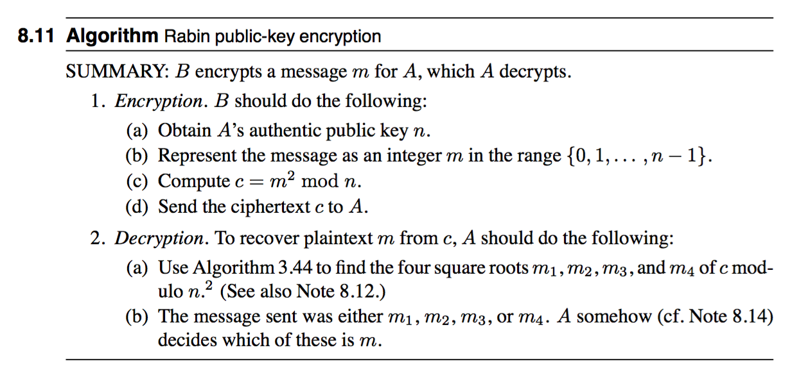

# PlaidCTF 2016: rabit (Crypto, 175)

說明：
> Just give me a bit, the least significant's enough. Just a second we’re not broken, just very, very insecure. Running at rabit.pwning.xxx:7763
>
> [rabit](https://github.com/ctfs/write-ups-2016/blob/6b72ec5ceb7aba2b123c71a468603a84ec945f7e/plaidctf-2016/crypto/rabit-175/rabit_8b98cc38ab1d0597ee51a30425d34d2e.tgz)

## 解題

連接到題目的伺服器後，先要解答一個proof-of-work，之後伺服器會回答加密的flag，我們可以要求解密任意的ciphertext，可是伺服器只會回答plaintext的LSB。

打開tarball得到伺服器的原始碼，裡面有encrypt和decrypt的方法。

```python
def getBlumPrime(nbits):
    p = getPrime(nbits)
    while p % 4 != 3:
        p = getPrime(nbits)
    return p

def genKey(nbits):
    p = getBlumPrime(nbits/2)
    q = getBlumPrime(nbits/2)
    N = p * q

    return ((p,q), N)

def randQR(N):
    return pow(getRandomRange(1, N), 2, N)

def encrypt(m, N):
    return pow(m, 2, N)

def legendreSymbol(a, p):
    return pow(a, (p-1)/2, p)

def decrypt(c, p, q):
    if GCD(c, p*q) != 1:
        return None
    if legendreSymbol(c, p) != 1:
        return None
    if legendreSymbol(c, q) != 1:
        return None
    return pow(c, ((p-1)*(q-1) + 4) / 8, p*q)

```

這題目用了[Rabin cryptosystem](https://en.wikipedia.org/wiki/Rabin_cryptosystem)（其實題目名稱早就暗示了）。Rabin不是常用的加密算法，不過因為它的有趣數學特性，CTF比賽裡常見這類題目。



Rabin和RSA cryptosystem相似，它們的安全性都是取決於對極大整數做質因數分解的難度。Rabin裡private key `n`為兩個極大質數`p`和`q`的積。Encrypt的定義是`c = m^2 mod n`，而decrypt即是求`c`的square root。為了簡化題目，題目用了 [Blum integer](https://en.wikipedia.org/wiki/Rabin_cryptosystem)作為private key，計算`c^(((p−1)(q−1)+4)/8) mod n`即可得到其中一個解。

設plaintext的flag為`m`，加密後得到`c`，`c ＝ m^2 mod n`。將`c`乘以`2^2`可得到`c' = (2m)^2 mod n`。Decrypt`c'`即可得到`2m`的 LSB。因`n`是單數，若`c'`的LSB是1，可推論出`2m > n`，相反若是0，則`2m < n`。

假設`2m (mod n)`的LSB為0，已知`m < n/2`。然後，取`4m (mod n)`的 LSB，若結果是1，可推論出`m < n/4`，相反結果是0，即得知`n/4 < m < n/2`。

重複這個步驟，每一步能把 flag 的範圍收窄一半。運用類似binary search的方法，就可以在`O(log2(n))`的時間內求出flag。

完整解答：[rabit.py](rabit.py)

## Flag

```
PCTF{LSB_is_4ll_y0u_ne3d}
```

## 其他解答

- https://github.com/ctfs/write-ups-2016/blob/master/plaidctf-2016/crypto/rabit-175/README.md